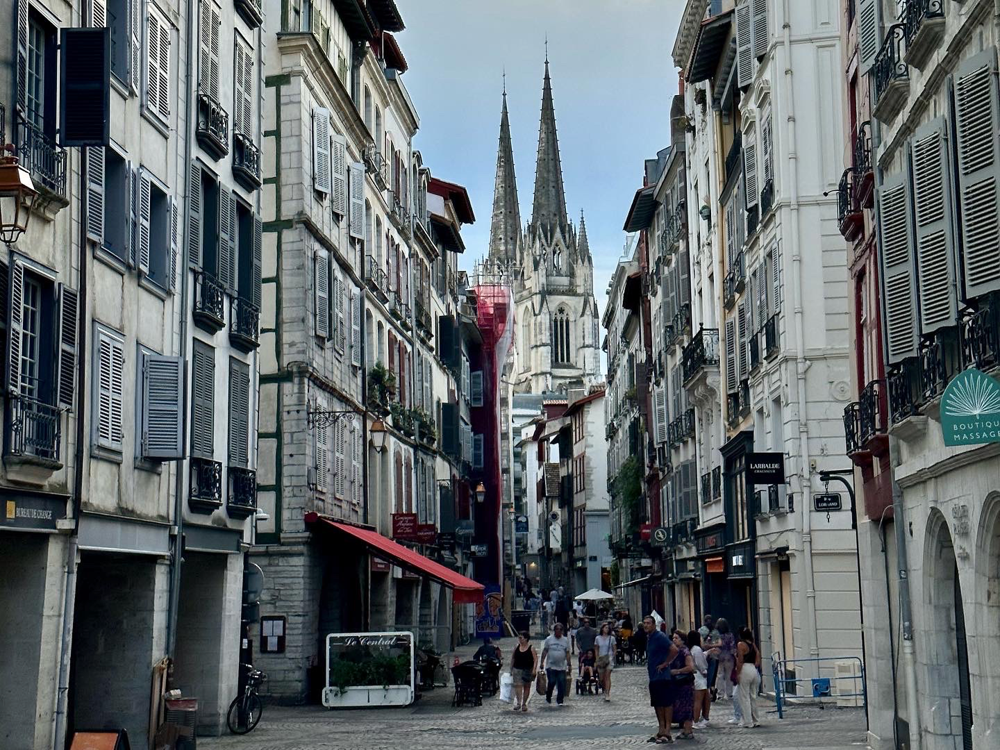

A great place to force the abdication of a rival monarch.



I passed through this gorgeous town to catch the train on the way back from [Biarritz](./biarritz.html). The city is famous as the location of the ["Abdications of Bayonne,"](https://en.wikipedia.org/wiki/Abdications_of_Bayonne) where Napoleon took advantage of Spanish political upheaval. Upset at mismanagement of the government of King Charles IV, supporters of his son Ferdinand VII organized a palace coup. Napoleon "settled" the succession dispute by summoning both monarchs to a French Imperial residence in Bordeaux, the Castle of Marracq, where he forced the abdication of boths monarchs,

```{r echo = FALSE, results = 'asis'}
titles <- c("Length of Stay", "Transportation", "Major Sights", "Unique Foods", "Restaurant Recommendations")
values <- c("4 Hours", "TER from Bordeaux Saint-Jean", "Bayonne Cathedral", "Basque Cake", "N/A")
df <- data.frame(titles, values)
library(knitr)
kable(df, col.names = NULL)
```


