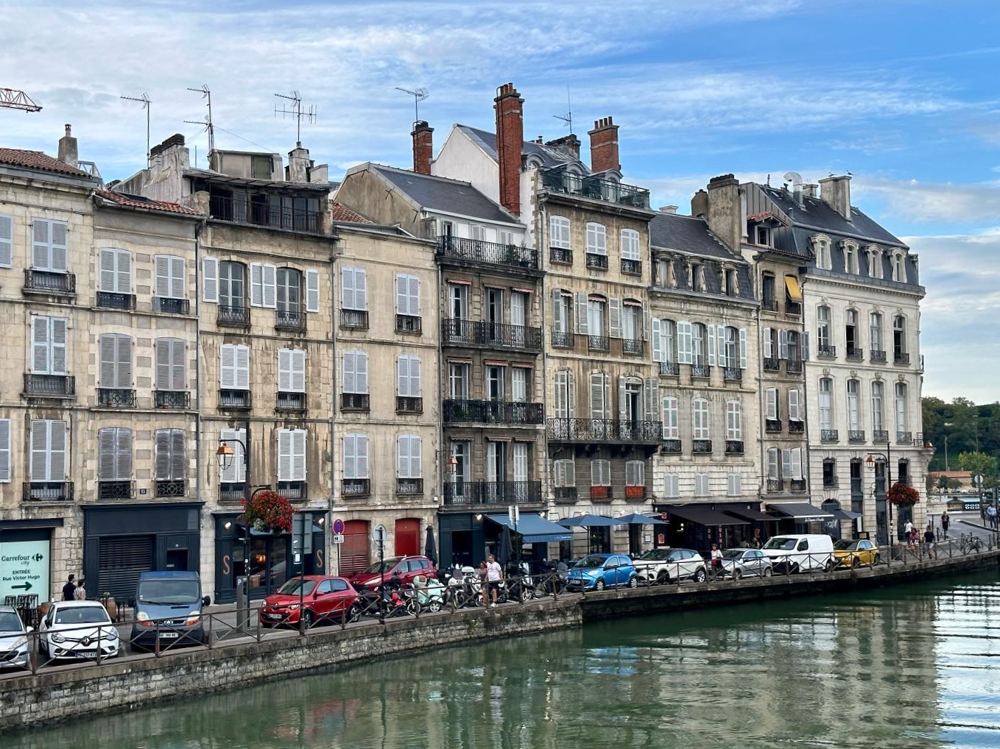
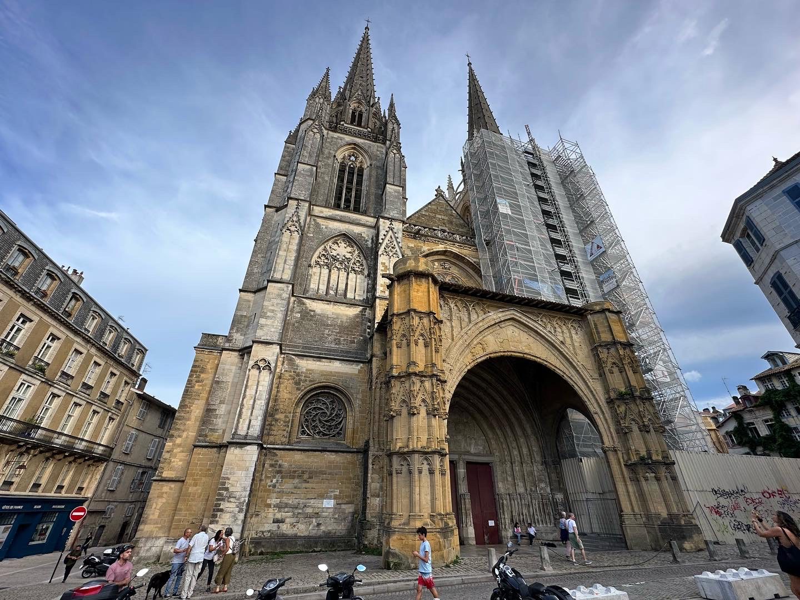

A great place to force the abdication of a rival monarch.

```{r out.width='100%', echo=FALSE}
cathedraleSaintMarie <- paste("<b>Cathédrale Saint-Marie</b>")
gareSaintEsprit <- paste("<b>Gare Saint-Esprit</b>")
pontSaintEsprit <- paste("<b>Pont Saint-Esprit</b>")
library(leaflet)
greenDotIcon <- makeIcon(iconUrl = "images/GreenDot.png", iconWidth = 10, iconHeight = 10, iconAnchorX = 0, iconAnchorY = 0)
leaflet() %>% addTiles() %>%
  setView(-1.4748, 43.4929, zoom = 15) %>%
  addMarkers(-1.471736, 43.494345, icon = greenDotIcon, popup = pontSaintEsprit) %>%  # Pont Saint-Esprit
  addMarkers(-1.477291, 43.490524, icon = greenDotIcon, popup = cathedraleSaintMarie) %>%  # Cathédrale Saint-Marie
  addMarkers(-1.470280, 43.497037, icon = greenDotIcon, popup = gareSaintEsprit) # Gare Saint-Esprit
```


I passed through this gorgeous town to catch the train on the way back from [Biarritz](./biarritz.html). The city is famous as the location of the ["Abdications of Bayonne,"](https://en.wikipedia.org/wiki/Abdications_of_Bayonne) where Napoleon took advantage of Spanish political upheaval. Upset at mismanagement of the government of King Charles IV, supporters of his son Ferdinand VII organized a palace coup, leading to a dynastic crisis. Napoleon "settled" the succession dispute by summoning both monarchs to a French Imperial residence in Bayonne, the Castle of Marracq, where he forced the abdication of both monarchs, who would remain in French custody until late 1813.

```{r echo = FALSE, results = 'asis'}
titles <- c("Length of Stay", "Transportation", "Major Sights", "Unique Foods", "Restaurant Recommendations")
values <- c("4 Hours", "TER from Bordeaux Saint-Jean", "Bayonne Cathedral", "Basque Cake", "N/A")
df <- data.frame(titles, values)
library(knitr)
kable(df, col.names = NULL)
```





The [Bayonne cathedral (Cathédrale Saint-Marie)](https://en.wikipedia.org/wiki/Bayonne_Cathedral) is a major attraction and the center of the Bayonne festival in mid-July.


The Bayonne train station ("gare").


The Pont Saint-Esprit was built from 1846 to 1849 and connects the train station to the Petit Bayonne (Little Bayonne) across the Adour River. Immediately after the bridge, the Adour merges with the Nive River, which separates Grand Bayonne from Petit Bayonne. 