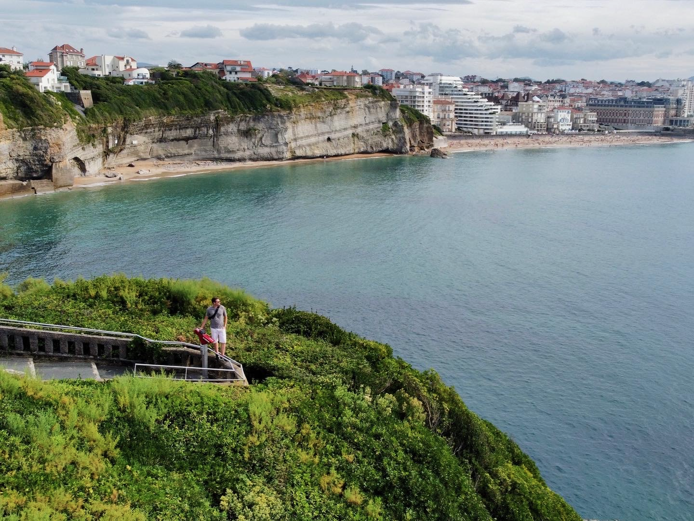

A seaside resort, fit for an empress.

```{r out.width='100%', echo=FALSE}
grandePlage <- paste("<b>Grande Plage</b>")
gareBiarritz <- paste("<b>Gare de Biarritz</b>")
rocherDeLaVierge <- paste("<b>Rocher De La Vierge</b>")
lighthouse <- paste("<b>Lighthouse</b>")
library(leaflet)
leaflet() %>% addTiles() %>%
  setView(-1.5586, 43.4832, zoom = 14) %>%
  addMarkers(-1.559345, 43.484722, icon = greenDotIcon, popup = grandePlage) %>%  # Grande Plage
  addMarkers(-1.545904, 43.459350, icon = greenDotIcon, popup = gareBiarritz) %>%  # Gare de Biarritz
  addMarkers(-1.570916, 43.484320, icon = greenDotIcon, popup = rocherDeLaVierge) %>%  # Rocher de la Vierge
  addMarkers(-1.553895, 43.493761, icon = greenDotIcon, popup = lighthouse) # Lighthouse
```


Biarritz & Bayonne are sister towns in the French Basque country that can be hit on the same day trip. Biarritz was a favorite vacation spot of Empress Eugenie, wife of Napoleon III, for good reason - it's a gorgeous seaside town, known for surfing and tanning on the beach.

```{r echo = FALSE, results = 'asis'}
titles <- c("Length of Stay", "Transportation", "Major Sights", "Unique Foods", "Restaurant Recommendations")
values <- c("5 Hours", "TER from Bordeaux Saint-Jean", "Biarritz Aquarium, Lighthouse", "Basque Cake", "N/A")
df <- data.frame(titles, values)
library(knitr)
kable(df, col.names = NULL)
```


The lighthouse is a well-known lightmark that periodically opens to be climbed and has great views.


Basque cake ("Etxeko bixkotxa," or "cake of the house" in Basque) is a local specialty, a mix between a cake and a cookie. Quality seems to vary a lot but it is definitely worth trying.

