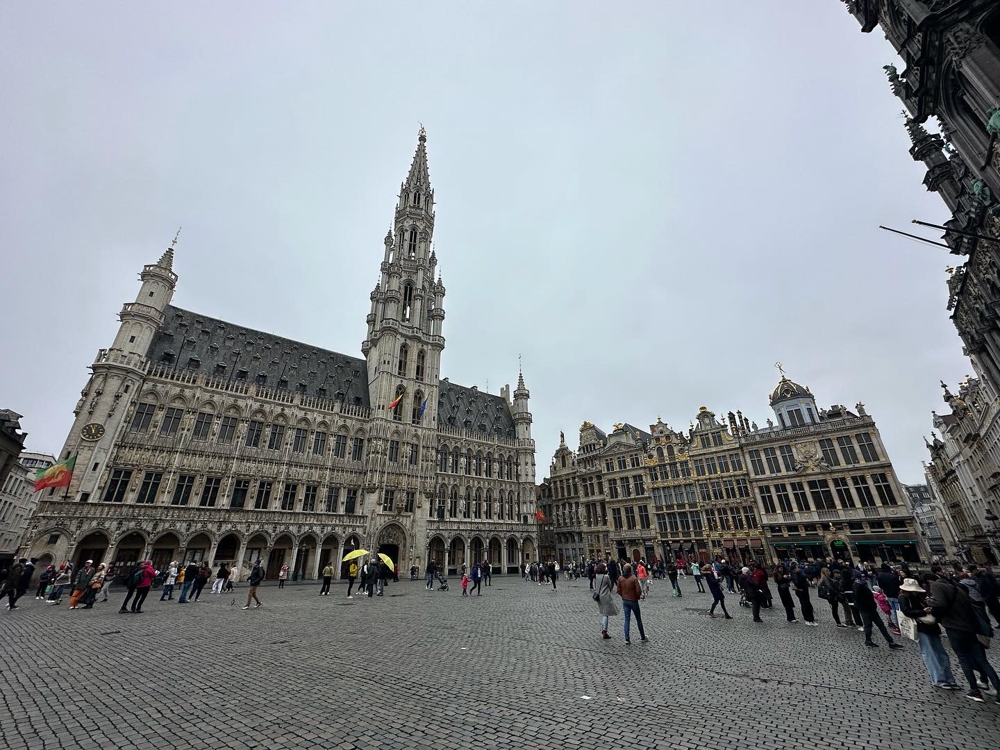
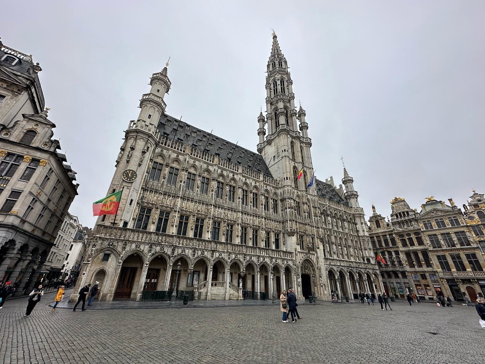

Eat your sprouts.

```{r out.width='100%', echo=FALSE}
grandPlace <- paste("<b>Grand Place</b>")
atomium <- paste("<b>Atomium</b>")
bourse <- paste("<b>Bourse de Bruxelles</b>")
royalMuseum <- paste("<b>Royal Museum of Fine Arts</b>")
cathedral <- paste("<b>Cathedral of St. Michael and St. Gudula</b>")
royalPalace <- paste("<b>Royal Palace</b>")
leaflet() %>% addTiles() %>%
  setView(4.369656, 50.847048, zoom = 12) %>%
  addMarkers(4.352527, 50.846719, icon = greenDotIcon, popup = grandPlace) %>% # Grand Place
  addMarkers(4.341522, 50.894917, icon = greenDotIcon, popup = atomium) %>% # Atomium
  addMarkers(4.350168, 50.848112, icon = greenDotIcon, popup = bourse) %>% # Stock Exchange
  addMarkers(4.358092, 50.841868, icon = greenDotIcon, popup = royalMuseum) %>% # Royal Museum of Fine Arts
  addMarkers(4.360082, 50.847838, icon = greenDotIcon, popup = cathedral) %>% # Cathedral of St. Michael and St. Gudula
  addMarkers(4.362264, 50.841923, icon = greenDotIcon, popup = royalPalace) # Royal Palace
```


Brussels is an incredibly historic city, yet has a modern, industrial feel, being dotted by glass and concrete office buildings, housing the headquarters of the European Union. The city is also home to the Atomium, a 102 metre tall structure built for the 1958 World's Fair. The Atomium is a model of an iron crystal, magnified 165 billion times. The structure is made up of nine spheres, connected by tubes, and contains a museum and restaurant. The square is a UNESCO World Heritage Site, and is considered one of the most beautiful squares in Europe. The Royal Palace is the official palace of the King and Queen of Belgium, and is used for state functions. The palace is open to the public during the summer months. The Royal Museum of Fine Arts is a museum containing a collection of paintings, sculptures, and drawings from the 15th to 18th centuries. The Bourse de Bruxelles is a former stock exchange, and is now used for exhibitions and concerts.

```{r echo = FALSE, results = 'asis'}
titles <- c("Length of Stay", "Transportation", "Major Sights","Unique Foods", "Restaurant Recommendations")
values <- c("Two days", "1.5 hour train ride from Lille", "Atomium, Grand Place", "Belgian waffles", "N/A")
df <- data.frame(titles, values)
library(knitr)
kable(df, col.names = NULL)
```

The Grand Place is the central square of Brussels, and is surrounded by the Town Hall and guildhalls. 





The Cathedral of St. Michael and St. Gudula is a Roman Catholic church, and is the national church of Belgium. The cathedral is a beautiful example of Gothic architecture.


