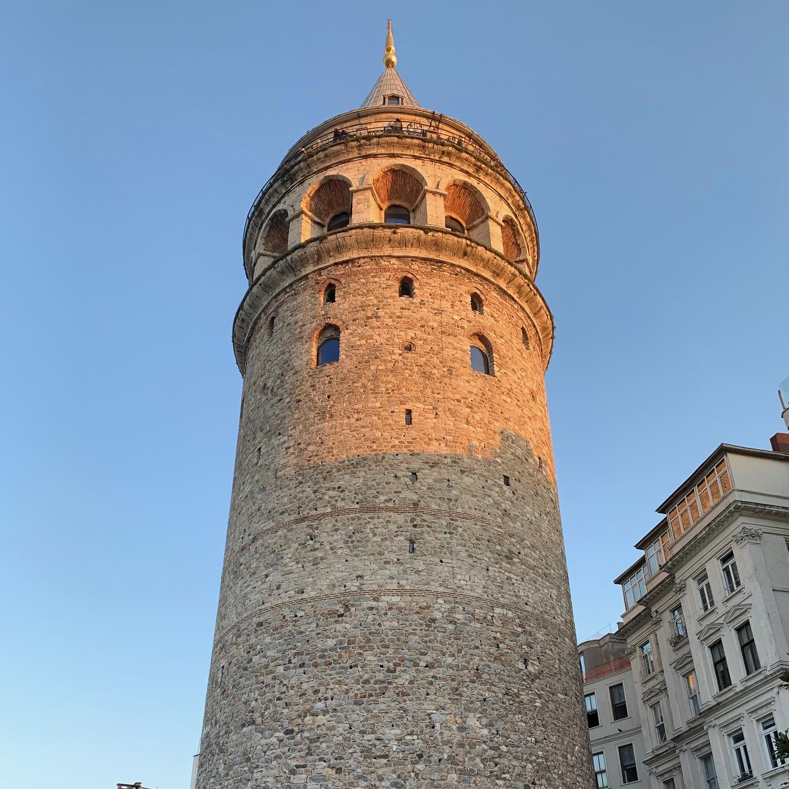

The Second Rome.

```{r out.width='100%', echo=FALSE}
hagiaSophia <- paste("<b>Hagia Sophia</b>")
topkapiPalace <- paste("<b>Topkapi Palace</b>")
istanbulArchaeologicalMuseum <- paste("<b>Istanbul Archaeological Museum</b>")
suleymaniye <- paste("<b>Süleymaniye Mosque</b>")
camlica <- paste("<b>Çamlıca Mosque</b>")
columnOfConstantine <- paste("<b>Column of Constantine</b>")
galataTower <- paste("<b>Galata Tower</b>")
grandBazaar <- paste("<b>Grand Bazaar</b>")
theodosianWalls <- paste("<b>Theodosian Walls</b>")
blueMosque <- paste("<b>Blue Mosque</b>")
basilicaCistern <- paste("<b>Basilica Cistern</b>")
theodosiusCistern <- paste("<b>Theodosius Cistern</b>")
maidensTower <- paste("<b>Maiden's Tower</b>")
palaceOfThePorphyrogenitus <- paste("<b>Palace of the Porphyrogenitus</b>")
princesIslands <- paste("<b>Princes' Islands</b>")
library(leaflet)
leaflet() %>% addTiles() %>%
  setView(28.990744, 41.019153, zoom = 12) %>%
  addMarkers(28.980021, 41.008484, icon = greenDotIcon, popup = hagiaSophia) %>%
  addMarkers(28.983190, 41.011348, icon = greenDotIcon, popup = topkapiPalace) %>%
    addMarkers(28.981714, 41.011651, icon = greenDotIcon, popup = istanbulArchaeologicalMuseum) %>%
    addMarkers(28.963975, 41.016290, icon = greenDotIcon, popup = suleymaniye) %>%
    addMarkers(29.070514, 41.034109, icon = greenDotIcon, popup = camlica) %>%
    addMarkers(28.971287, 41.008554, icon = greenDotIcon, popup = columnOfConstantine) %>%
    addMarkers(28.974203, 41.025628, icon = greenDotIcon, popup = galataTower) %>%
    addMarkers(28.968517, 41.010646, icon = greenDotIcon, popup = grandBazaar) %>%
    addMarkers(28.935199, 41.030083, icon = greenDotIcon, popup = theodosianWalls) %>%
    addMarkers(28.976668, 41.005431, icon = greenDotIcon, popup = blueMosque) %>%
    addMarkers(28.977818, 41.008113, icon = greenDotIcon, popup = basilicaCistern) %>%
    addMarkers(28.972425, 41.007426, icon = greenDotIcon, popup = theodosiusCistern) %>%
    addMarkers(28.940479, 41.033692, icon = greenDotIcon, popup = palaceOfThePorphyrogenitus) %>%
    addMarkers(29.004062, 41.021107, icon = greenDotIcon, popup = maidensTower) %>%
    addMarkers(29.091624, 40.875363, icon = greenDotIcon, popup = princesIslands)
```


Istanbul is a city of history, culture, and beauty. Having been the capital of great empires, it offers an enchanting blend of Greek, Roman, Ottoman, Byzantine, and modern Turkish influences. The city is home to many historical sites, including the Hagia Sophia, Topkapi Palace, Istanbul Archaeological Museum, Süleymaniye Mosque, Grand Çamlıca Mosque, Column of Constantine, Galata Tower, Grand Bazaar, Theodosian Walls, Blue Mosque, Basilica Cistern, Theodosius Cistern, Palace of the Porphyrogenitus, and Princes' Islands. The city is hilly, but your time hiking around the Golden Horn and the Bosphorus will be well worth it. 

```{r echo = FALSE, results = 'asis'}
titles <- c("Length of Stay", "Transportation", "Major Sights","Unique Foods", "Restaurant Recommendations")
values <- c("Two months", "3 hour flight from Frankfurt", "Hagia Sophia, Topkapi Palace, Istanbul Archaeological Museum, Süleymaniye, Grand Çamlıca", "Raki", "")
df <- data.frame(titles, values)
library(knitr)
kable(df, col.names = NULL)
```


Hagia Sophia is a landmark of the city. Built in 537 AD, it was the world's largest cathedral for nearly a thousand years. It was later converted into a mosque. 


Above the door, Constantine the Great and Justinian I are depicted making offerings to the Virgin Mary.


Across from Hagia Sophia is Sultan Ahmet Camii, also known as the Blue Mosque. It was built in 1616 and is known for its blue tiles. It was undergoing renovations when I visited but has since reopened.


Nearby is the former site of the Hippodrome of Constantinople. The Obelisk of Theodosius, the Serpent Column, and the Walled Obelisk are still standing.


Nearby is also the former site of the Great Palace of Constantinople, the residence of the Byzantine emperors. A museum is now located on the site to show the ornate mosaics that once adorned the palace.


Süleymaniye Mosque was built in 1557 and is the second largest mosque in the city. It was built by the famous architect Mimar Sinan for the Ottoman sultan Suleiman the Magnificent.


The walls of Constantinople, called the Theodosian Walls, were built in the 5th century and are still standing today. The Palace of the Porphyrogenitus was a Byzantine palace built into the walls themselves and was recently restored.


Hagia Irene was a sister church to Hagia Sophia, one of a trinity intended to be built. It was used as an armory by the Ottomans, and is now a museum.


Across from Hagia Irene is Topkapi Palace, the residence of the Ottoman sultans for 400 years. It is now a museum and is a must-see for anyone visiting the city.


Also across from Hagia Irene is the Istanbul Archaeological Museum, which houses a large collection of artifacts from the country's history. The Ottoman sultan Abdulaziz was inspired to build the museum following a tour of the great museums of Europe in 1867.


The Theodosius Cistern was built in the 5th century and is still standing today. It was used to store water for the city.


Looking across the water, the Golden Horn separates the old city and it's Fatih district from the rest of the city.


Galata Tower offers a panoramic view of the city. It was built in 1348 and was the tallest building in Istanbul at the time.




Galata Tower lies near the end of the Istiklal Caddesi, a pedestrian street lined with shops, restaurants, and cafes, in the upscale Beyoğlu district.


At the other end of the street is Taksim Square, a major transportation hub and the site of many protests and celebrations.


Dolma Bahçe Palace was built in 1856 and was the main administrative center of the Ottoman Empire. It is now a museum and is great impressive, equal to the great palaces built by other European monarchs.


On the Asian side, the largest mosque in the city is the Grand Çamlıca Mosque, which was completed in 2019, at the behest of President Erdogan. It is located on the highest hill in the city, on the Asian side of the Bosphorus, and offers a panoramic view of the city.


Raki is a Turkish liquor that was popularized by Mustafa Kemal Ataturk, the first President of Turkey. It is an anise-flavored spirit that is often mixed with water and ice. It's an acquired taste, not unlike ouzo, but it's worth trying.


The Princes' Islands are a group of nine islands in the Sea of Marmara. They are a popular destination for day trips from the city. The islands are car-free and are known for their horse-drawn carriages. I visited Buyukada for a concert and enjoyed it. They are, by far, the least populated district of Istanbul.


Recep Tayyip Erdoğan stadium is the home of the Turkish football club Fenerbahçe. The President sometimes makes appearances at games.


Ortakoey Mosque is a mosque located on the Bosphorus. Built in 1856, it is a popular spot for tourists and locals alike for its view of the Bosphorus Bridge.


Outside the city centre is the Rumeli Fortress, built in 1452 by Mehmed the Conqueror to prepare for the siege of Constantinople. 


Smoking shisha was one of my favorite pastimes in Istanbul. It's a great way to relax and enjoy the city.


Turkish tea is a staple of Turkish culture. It is served in small glasses, often drunk with sugar, and served after meals for free as a palate cleanser.


