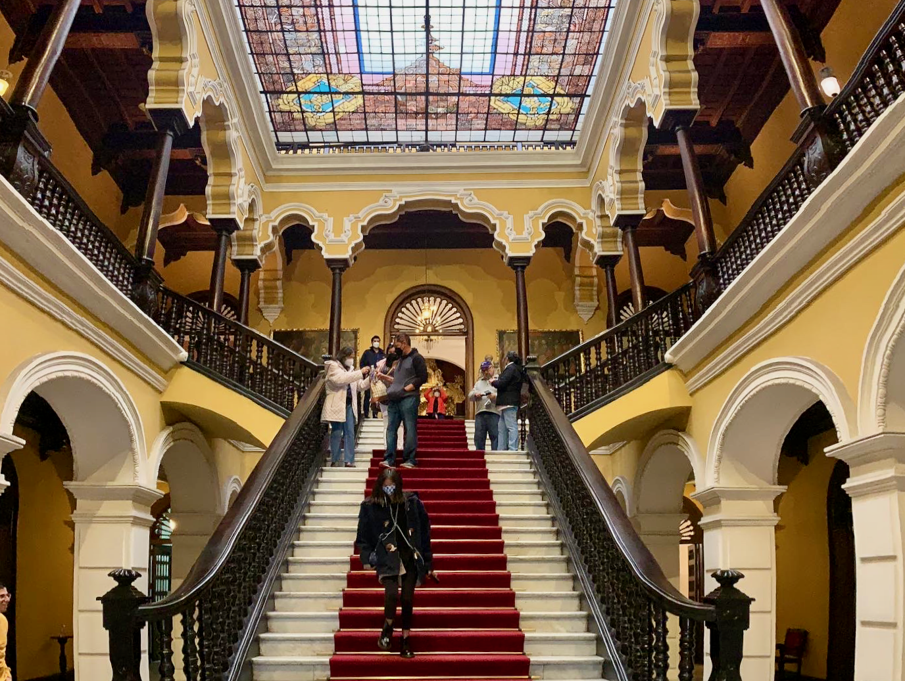

Lima, la gris.

```{r out.width='100%', echo=FALSE}
limaCathedral <- paste("<b>Lima Cathedral</b>")
huacaPucllana <- paste("<b>Huaca Pucllana</b>")
basilicaSanFranciso <- paste("<b>Basilica and Convent of San Francisco of Lima</b>")
museoLarco <- paste("<b>Museo Larco</b>")
leaflet() %>% addTiles() %>%
  setView(-77.071154, -12.082091, zoom = 10) %>%
  addMarkers(-77.029706, -12.046776, icon = greenDotIcon, popup = limaCathedral) %>%
  addMarkers(-77.033333, -12.111078, icon = greenDotIcon, popup = huacaPucllana) %>%
  addMarkers(-77.027439, -12.045291, icon = greenDotIcon, popup = basilicaSanFranciso) %>%
  addMarkers(-77.070926, -12.072734, icon = greenDotIcon, popup = museoLarco)
```


Founded by conquistador Francisco Pizarro in 1535, Lima is the capital of Peru and the largest city in the country. It is located in the valleys of the Chillón, Rímac and Lurín rivers, in the central coastal part of the country, overlooking the Pacific Ocean. Together with the seaport of Callao, it forms a contiguous urban area known as the Lima Metropolitan Area. With a population of more than 9 million, Lima is the most populous metropolitan area of Peru and the fourth-largest city in the Americas (as defined by "city proper"), behind São Paulo, New York, and Mexico City.

```{r echo = FALSE, results = 'asis'}
titles <- c("Length of Stay", "Transportation", "Major Sights","Unique Foods", "Restaurant Recommendations")
values <- c("Three days", "Six hour flight from Chicago", "Lima Metropolitan Cathedral, Museo Larco", "Pan con chicharones", "")
df <- data.frame(titles, values)
library(knitr)
kable(df, col.names = NULL)
```

Lima Metropolitan Cathedral is located in the Plaza de Armas, the main square of Lima. The church was first built in 1535, and was rebuilt in 1564. The church displays a mix of architectural styles, including Gothic, Baroque, and Neoclassical. The church is home to the tomb of Francisco Pizarro, the founder of Lima. 




Pan con chicharones is a popular Peruvian breakfast. It is made with pan-fried pork, sweet potato, and onions. The sandwich is typically served on a French roll.


Huaca Pucllana is a ancient burial mound located in the Miraflores district of Lima. The site was built by the Lima culture, a pre-Inca civilization that thrived in the area between 200 and 700 AD. The site is made of adobe bricks, and is a popular tourist destination. Human sacrifices were made at the site, and the remains of 40 individuals have been found.


Museo Larco is a privately owned museum located in the Pueblo Libre district of Lima. The museum is housed in an 18th century mansion, and is home to a large collection of pre-Columbian art. Definitely the best collection of Native American art I have ever seen.


