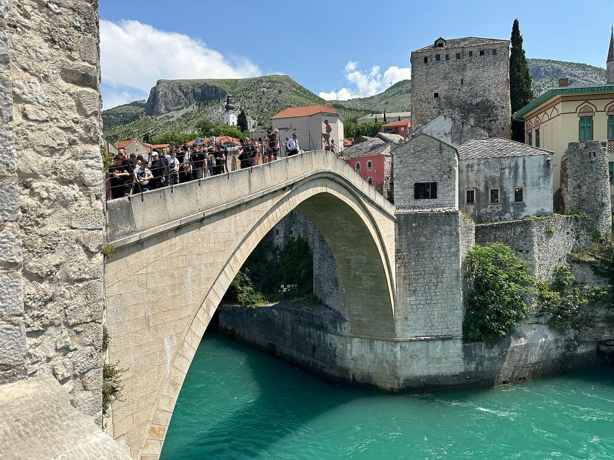
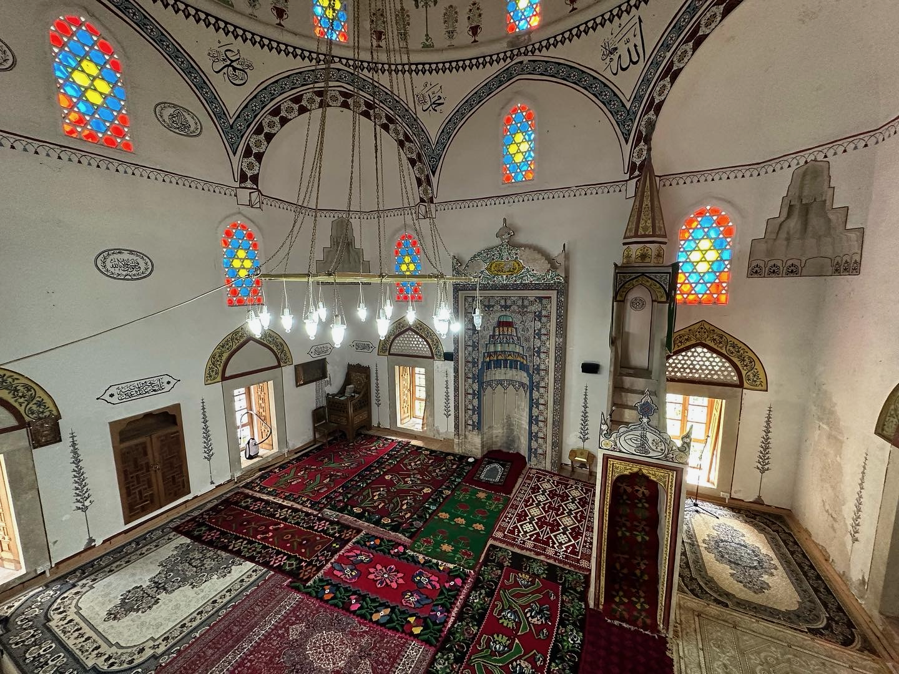

Be sure to jump off the bridge (I didn't).

```{r out.width='100%', echo=FALSE}
stariMost <- paste("<b>Stari Most</b>")
mosque <- paste("<b>Mosque</b>")
library(leaflet)
leaflet() %>% addTiles() %>%
  setView(17.811843, 43.342263, zoom = 14) %>%
  addMarkers(17.815055, 43.337268, icon = greenDotIcon, popup = stariMost) %>% # Old Bridge
  addMarkers(17.814795, 43.338601, icon = greenDotIcon, popup = mosque) # Mehmed Mosque
```



```{r echo = FALSE, results = 'asis'}
titles <- c("Length of Stay", "Transportation", "Major Sights", "Restaurant Recommendations")
values <- c("2 days", "3 hours by bus from Split", "Stari Most (Old Bridge)", "Oscar")
df <- data.frame(titles, values)
library(knitr)
kable(df, col.names = NULL)
```


The town's iconic bridge was built in the 16th century, but was destroyed in 1993 during the Balkan Wars. It has since been rebuilt and is a UNESCO World Heritage Site. Divers wait on the bridge - it's 23 meter drop. You can jump yourself if you talk to the diving school next to the bridge, get some lessons, do practice jumps, and pay a fee.


The town's mosque is also quite nice.





